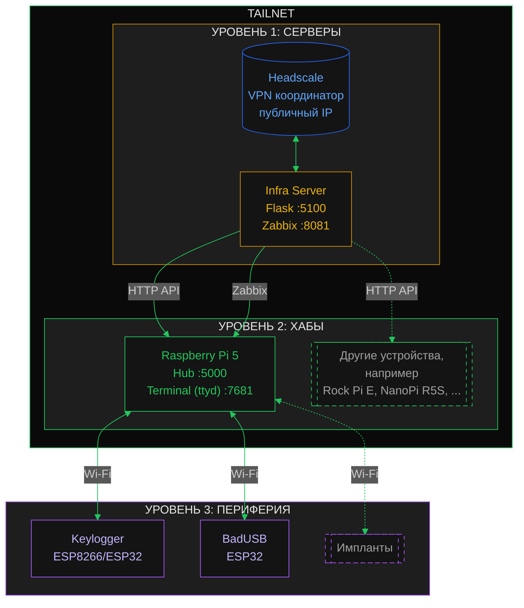

# Архитектура

Централизованное управление распределёнными атакующими устройствами. Трёхуровневая модель.

## Обзор

Функции системы:
- Генерация и развёртывание образов устройств
- Мониторинг состояния инфраструктуры
- Удалённое управление через VPN
- Иерархическая организация устройств

## Схема



## Уровни системы

### Уровень 1: Сервер

Центральное управление всей инфраструктурой.

| Компонент | Расположение | Функции |
|-----------|--------------|---------|
| Headscale Server | Интернет (VPS) | Координация Tailscale VPN, авторизация устройств |
| Infra Server | Tailscale сеть | Веб-интерфейс, генерация образов, Zabbix мониторинг |

### Уровень 2: Хабы

Одноплатные компьютеры, развёрнутые на целевых локациях.

| Устройство | Назначение | Сервисы |
|------------|------------|---------|
| Raspberry Pi 5 | Основной хаб | Hub (:5000), ttyd (:7681), SSH (:22) |

Также поддерживаются: Rock Pi E (sniffer), NanoPi R5S (3-port router) и другие ARM64 SBC.

Особенности хабов:
- Подключены к Tailscale VPN
- eth0 отключён по умолчанию (безопасность)
- Zabbix Agent для мониторинга
- Управляют устройствами 3-го уровня через Wi-Fi AP

### Уровень 3: Периферия (ESP8266/ESP32)

Микроконтроллеры для специализированных задач.

| Устройство | Функция |
|------------|---------|
| Keylogger | Перехват ввода с клавиатуры |
| BadUSB | Эмуляция HID-устройств |
| Wi-Fi Deauth | Деаутентификация клиентов |
| BLE Scanner | Сканирование Bluetooth устройств |

Особенности:
- Работают автономно
- Подключаются к хабам через Wi-Fi (AP режим)
- Отдают логи по HTTP на хаб
- Не имеют прямого доступа в Tailscale

## Безопасность

- Все коммуникации через Tailscale VPN (WireGuard)
- eth0 на хабах отключён по умолчанию
- Веб-интерфейсы доступны только внутри VPN
- Периферия изолирована в локальной сети хаба
- Авторизация устройств через Headscale

## Компоненты репозитория

```
├── server/              # Infra Server (Flask)
│   ├── app.py          # Основное приложение
│   └── images/         # Генерация образов
├── hub/                 # Hub приложение (Flask)
│   └── app.py          # Управление периферией
├── image-scripts/       # Скрипты сборки образов
└── docs/               # Документация
```
